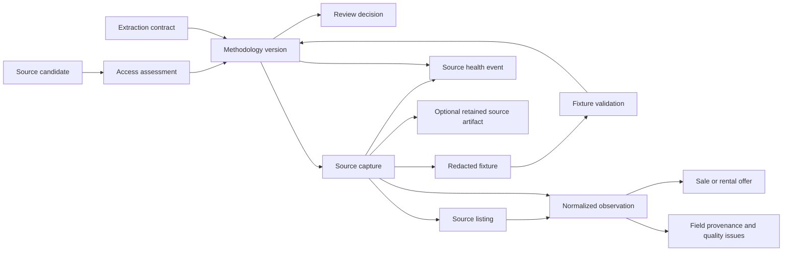
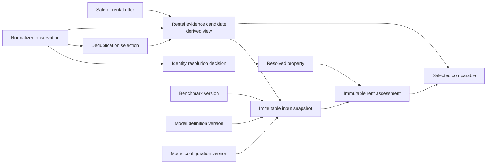
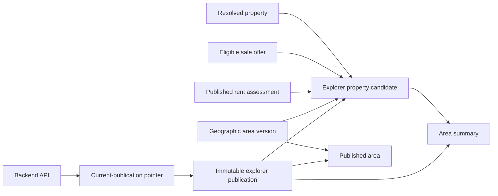

# Data storage conceptual model

## Purpose

This model explains the durable business concepts behind the Data Storage
System. It is the bridge between the storage use cases and the later logical
ERD.

It deliberately does **not** choose SQL tables, columns, primary-key formats,
indexes, or ORM types. A concept belongs in the later ERD only when it has a
clear owner, persistence purpose, and relationship described here.

## How to read this model

- A box is a business concept, not necessarily one database table.
- Solid arrows mean “creates,” “uses,” or “is derived from.”
- An immutable version is a new record, never an edit to a past fact.
- A derived view answers a consumer question but does not replace the evidence
  from which it was derived.

## 1. Source governance and collection

The reviewer authorizes a methodology version, not a source candidate or an
individual fixture. The methodology pins the reviewed access scope, extraction
contract, parser/normalizer identity, redaction policy, and retention policy
used by each capture.

A source capture is one acquisition event. It remains distinct even when a
later capture has identical bytes. A retained source artifact is optional: it
exists only when policy permits redacted replay material or an original source
document for an approved replay or audit purpose.

One source listing is a source-qualified identity, such as a portal’s listing
ID plus its stable URL. It can have many normalized observations over time. An
observation keeps the source claim, its canonical interpretation, its offers,
field provenance, and any quality issues separate.

## 2. Property identity and Rent Model evidence

Identity resolution is deliberately conservative. A decision may link source
observations to a resolved property, decide that they are not the same, or
leave them ambiguous. It never deletes source listings or observations.
Deduplication is a later, versioned choice of which observations count for one
analysis; it is not a merge.

The rental-evidence candidate is a derived, model-only view. It includes only
eligible observed rental facts and their provenance. It is not a place to store
a modeled rent. It contains no sale price, yield, ranking, or value derived
from sale price.

The input snapshot freezes the evidence, benchmarks, identity/deduplication
decisions, model definition, and configuration used for one reproducible input
set. A rent assessment records the resulting observed, modeled, benchmark, or
insufficient-data conclusion. A comparable-based assessment also records its
ordered selected comparables and calculations.

## 3. Explorer publication

The publication projector combines one resolved property, one eligible sale
basis, and one observed or estimated rent basis into an explorer property
candidate. This candidate is not a raw listing, a crawler capture, or a Rent
Model comparable.

An explorer publication is an immutable complete release: its areas,
properties, and summaries belong to the same version. A separate current-
publication pointer changes only after a full release validates. The Backend
API reads through that pointer and never needs crawler, model, or object-store
internals.

## Ownership and persistence purpose

| Concept group                     | Created or maintained by                      | Why it persists                                                                              |
| --------------------------------- | --------------------------------------------- | -------------------------------------------------------------------------------------------- |
| Source governance                 | Research tools, trusted reviewer, and Storage | Shows what source access was considered, reviewed, approved, blocked, or retired.            |
| Captures and observations         | Crawler through the Storage ingestion port    | Preserves what was collected and how it was interpreted without overwriting history.         |
| Artifacts and fixtures            | Crawler and Storage under policy              | Replays a parser or supports an approved evidence audit without retaining images by default. |
| Identity and deduplication        | Identity resolver and governed review         | Keeps cross-source choices conservative and reversible.                                      |
| Rental evidence and model history | Snapshot builder and Rent Model               | Makes each assessment reproducible and prevents sale price from entering rent estimation.    |
| Explorer publication              | Publication projector                         | Gives the Backend API one complete, read-only release for map and chart use.                 |

## Relationship rules for the ERD

The logical ERD must make these rules explicit:

1. A source candidate can have many assessments; an assessment can support many
   methodology proposals only when their scopes are compatible.
2. A methodology version can govern many captures, but every capture records
   exactly one methodology version.
3. A capture can produce zero or more source listings and normalized
   observations; a source listing can have many observations over time.
4. An observation can have zero or more offers, provenance entries, and quality
   issues. Sale and rental offers remain distinct.
5. A source observation can participate in many historical identity decisions;
   “current” membership is derived from the effective decision history.
6. A model snapshot has ordered evidence and benchmark members. Its membership
   and content hashes never change after creation.
7. An assessment references one snapshot and can have zero or more selected
   comparables.
8. A publication has one versioned population of areas, explorer properties,
   and summaries. The current-publication pointer refers to one complete
   publication at a time.

## Explicit non-relationships

- A sale offer does not feed rental evidence or the Rent Model estimator.
- A modeled rent does not become rental evidence for another assessment.
- The Backend API does not read source captures, raw artifacts, identity
  internals, or model snapshots.
- An object-storage artifact does not replace capture metadata, provenance, or
  a normalized observation.
- A cross-source match does not delete, overwrite, or collapse the original
  source records.

## Next step

The next ticket derives the logical ERD from this model. It should introduce
only entities and relationships justified above; physical schema decisions stay
out of scope.
