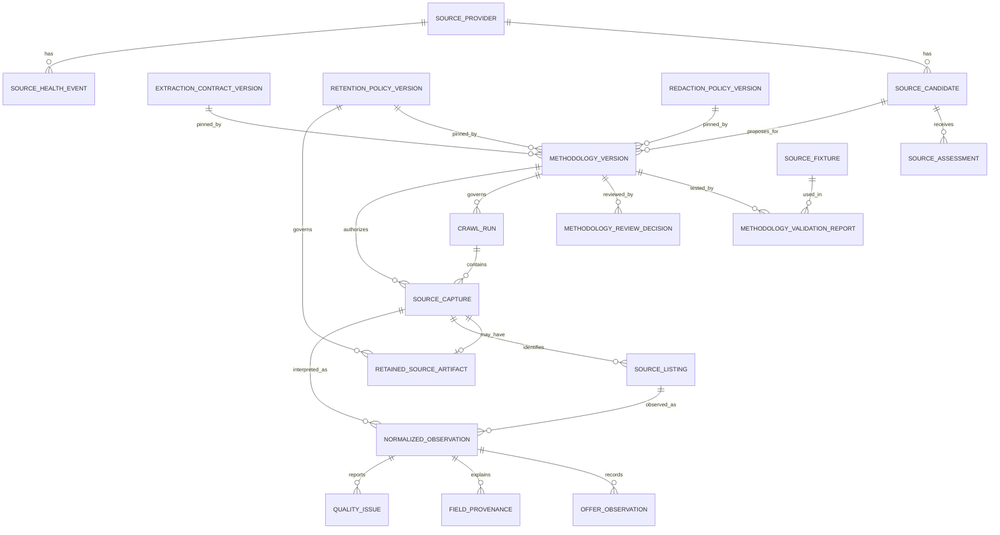
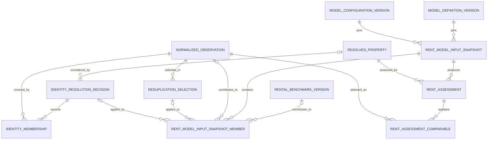
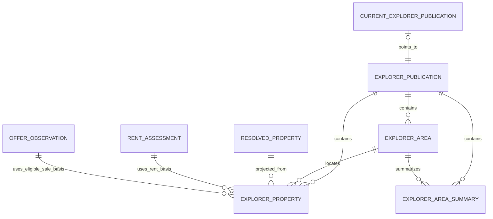

# Data storage logical ERD

## Purpose

This is the logical entity-relationship design for the data-storage system. It
turns the [storage use cases](../../specs/data-storage-spec.md#storage-use-cases)
and [conceptual model](data-storage-conceptual-model.md) into durable record
groups and their relationships. It is deliberately not a database schema:
physical keys, columns, indexes, partitions, ORM models, and migrations are
decided later.

The ERD has three views so that each remains readable:

1. source governance, collection, and interpretation;
2. identity and Rent Model history; and
3. the backend explorer publication.

`||` means exactly one, `o|` means zero or one, and `o{` means zero or many.
Every entity marked **immutable** is append-only: correcting it creates a new
record rather than changing the historical record. “Current” is a derived
selection, except for the explicit current-publication pointer.

## 1. Governance, collection, and interpretation

### Entities and persistence purpose

| Entity group                                                         | Logical identity and boundary                                                            | Why it persists                                                                       | Use-case trace                                      |
| -------------------------------------------------------------------- | ---------------------------------------------------------------------------------------- | ------------------------------------------------------------------------------------- | --------------------------------------------------- |
| Source provider                                                      | One considered source                                                                    | Stable root for review, methodology, health, and collection history                   | Review source; resolve approved methodology         |
| Source candidate                                                     | **Immutable** proposed source plus intended scope                                        | A corrected proposal must not silently inherit an earlier review                      | Review source; resolve approved methodology         |
| Source assessment                                                    | **Immutable**, dated conclusion about access, terms, robots, API, privacy, and retention | Records what was assessed and the evidence for it                                     | Review source; resolve approved methodology         |
| Extraction contract, retention policy, and redaction policy versions | **Immutable** named rules                                                                | Makes parsing and retention rules explicit and replayable                             | Validate methodology; ingest capture                |
| Methodology version                                                  | **Immutable** approved-or-proposed collection manifest                                   | Pins the allowed scope, adapter, parser, policies, and field mapping for a collection | Resolve approved methodology; ingest capture        |
| Methodology validation report and review decision                    | **Immutable** test result and authorization history                                      | Separates technical verification from a reviewer’s permission                         | Validate methodology; resolve approved methodology  |
| Source fixture                                                       | Permitted synthetic or redacted fixture identity                                         | Reproduces validation without live source access                                      | Validate methodology                                |
| Crawl run                                                            | One execution under one methodology version                                              | Groups execution events without becoming listing identity                             | Ingest capture; record health                       |
| Source capture                                                       | One acquisition event, source-qualified by `(source, capture event)`                     | Preserves collection history even when fetched bytes repeat                           | Ingest capture; replay/audit an observation         |
| Retained source artifact                                             | Optional **immutable** permitted body representation linked to one capture               | Holds replay or audit evidence outside PostgreSQL when policy permits                 | Replay/audit an observation; enforce retention      |
| Source listing                                                       | One source-qualified listing identity                                                    | Prevents a source’s listing identifier being mistaken for another source’s identifier | Ingest observation; resolve property identity       |
| Normalized observation                                               | **Immutable** interpretation of one capture under one exact interpretation identity      | Preserves canonical facts without rewriting the source claim                          | Ingest observation; build rental evidence           |
| Offer observation                                                    | **Immutable** sale _or_ rental offer observed in an observation                          | Keeps different commercial claims distinct in history                                 | Build rental evidence; project explorer publication |
| Field provenance and quality issue                                   | **Immutable** field explanation and typed warning/block                                  | Makes individual facts auditable and lets bad outcomes be retained safely             | Audit observation; quarantine outcome               |
| Source health event                                                  | **Immutable** operational or safety event                                                | Supports pause/block decisions without erasing history                                | Record health; resolve approved methodology         |

### Interpretation identity and offer boundary

A normalized observation is uniquely the interpretation of a capture using its
methodology-manifest hash, adapter-artifact hash, parser version, normalizer
version, and extraction-contract hash. Its output hash validates the outcome;
it is not part of the interpretation identity. Therefore a parser or
methodology change creates a new observation for the same capture.

`OFFER_OBSERVATION` has mutually exclusive sale and rental variants. A sale
variant holds a sale claim. A rental variant holds the observed base asking
rent and its frequency, fees, and terms. Only the rental variant can be
considered by the Rent Model; there is no relationship from a sale offer to a
Rent Model input snapshot or assessment.

## 2. Property identity and Rent Model history

### Entities and persistence purpose

| Entity group                                | Logical identity and boundary                                                                           | Why it persists                                                        | Use-case trace                                           |
| ------------------------------------------- | ------------------------------------------------------------------------------------------------------- | ---------------------------------------------------------------------- | -------------------------------------------------------- |
| Resolved property                           | Conservative candidate for one real-world property                                                      | Gives analysis a stable identity without replacing any source identity | Resolve property identity; assess rent; publish explorer |
| Identity resolution decision                | **Immutable** match, non-match, or manual decision with supporting basis                                | Cross-source matching stays reviewable and reversible                  | Resolve property identity; build rental evidence         |
| Identity membership                         | Observation membership covered by one identity decision                                                 | States exactly which observations a decision covers                    | Resolve property identity; build rental evidence         |
| Deduplication selection                     | **Immutable** analytic choice among retained observations                                               | Avoids double-counting without deleting original observations          | Build rental evidence; assess rent                       |
| Rental benchmark version                    | **Immutable** benchmark and provenance                                                                  | Prevents fallback evidence from drifting                               | Build rental evidence; assess rent                       |
| Model definition and configuration versions | **Immutable** calculation artifact and behavior rules                                                   | Pins the calculation as well as its parameters                         | Create snapshot; assess rent                             |
| Rent Model input snapshot                   | **Immutable**, content-addressed canonical evidence set with an as-of date                              | Reproduces the exact model boundary used for an assessment             | Create snapshot; assess rent; audit assessment           |
| Snapshot member                             | **Immutable**, ordered included subject, eligible rental observation, benchmark, and decision reference | Explains the snapshot’s precise membership and exclusions              | Create snapshot; audit assessment                        |
| Rent assessment                             | **Immutable** observed, estimated, fallback, or insufficient-data result                                | Keeps a published result explainable at its historical as-of date      | Assess rent; publish explorer                            |
| Assessment comparable                       | **Immutable**, ordered selected comparable                                                              | Shows why a comparable-modeled assessment was produced                 | Assess rent; audit assessment                            |

### Identity and evidence rules

- A resolved property is not a source listing. Source listings and normalized
  observations remain intact whether an identity decision is accepted, later
  revised, or rejected.
- An observation can appear in multiple historical identity decisions and
  deduplication selections. Consumers derive the applicable decision for a
  particular snapshot; they do not overwrite old decisions.
- The snapshot’s canonical membership is limited to eligible rental evidence,
  permitted benchmarks, and the relevant identity/deduplication decisions.
  It exposes neither a sale offer nor a sale price to the Rent Model.
- The snapshot, its members, assessment, and comparable rows are historical
  records. An identical rerun can reuse the snapshot and record another
  assessment occurrence; a changed input or rule produces a new snapshot.

## 3. Explorer publication

### Entities and persistence purpose

| Entity group                 | Logical identity and boundary                         | Why it persists                                                                                                                 | Use-case trace                                  |
| ---------------------------- | ----------------------------------------------------- | ------------------------------------------------------------------------------------------------------------------------------- | ----------------------------------------------- |
| Explorer publication         | **Immutable** complete backend release                | Gives every reader one validated, internally consistent explorer dataset                                                        | Publish explorer release; read current explorer |
| Explorer area                | One area in one publication                           | Supplies the hierarchy, map shape/reference, and display metadata for that release                                              | Publish explorer release; read current explorer |
| Explorer property            | One resolved residential candidate in one publication | Supplies a map marker and rankable property candidate, combining a permitted sale basis with an observed or assessed rent basis | Publish explorer release; read current explorer |
| Explorer area summary        | One area aggregate in one publication                 | Makes counts and aggregates traceable to the same property population                                                           | Publish explorer release; read current explorer |
| Current explorer publication | The one mutable pointer to a completed publication    | Makes a complete release visible atomically while retaining prior releases                                                      | Read current explorer                           |

The backend reads the current-publication projection, not collection,
governance, identity, or Rent Model working records. The publication projector
is the only writer for this view. It must publish areas, properties, and
summaries under the same publication identity before moving the current pointer.
An explorer property retains links to its resolved property, eligible sale
basis, and rent assessment so a release can be traced back without making the
backend join those internal records during a request.

## Relationship decisions carried into physical design

The following are logical invariants that a future physical design must
preserve; they are not prescriptions for tables or keys:

- Every capture belongs to exactly one crawl run and one methodology version;
  a permitted artifact belongs to at most one capture.
- A normalized observation belongs to one capture and one source listing, but
  a capture or listing may have no successful interpretation or many historical
  interpretations.
- Each offer, provenance item, and quality issue explains one normalized
  observation. Offer type determines whether it is sale or rental.
- Identity membership exists only under an identity decision and links that
  decision to an observed record. This is the deliberate separation between
  source-qualified identity and cross-source identity.
- A snapshot has an ordered canonical set of members and pins one model
  definition and configuration. An assessment has one snapshot and one
  assessed resolved property.
- A comparable explains one assessment and identifies the selected normalized
  observation. Its eligibility must be derivable from the assessment’s
  snapshot, never from a sale offer.
- Each area, explorer property, and area summary belongs to exactly one
  explorer publication. A current pointer points to zero or one completed
  publication; it is the only mutable record in this view.

## Traceability to the conceptual model

| Conceptual model section               | Logical ERD entity groups                         | Storage use cases served                                                               |
| -------------------------------------- | ------------------------------------------------- | -------------------------------------------------------------------------------------- |
| Source governance and collection       | Provider through source health event              | Review source, validate/resolve methodology, ingest capture, retain permitted evidence |
| Normalization and observation history  | Source capture through quality issue              | Ingest outcome, replay/audit, quarantine without loss                                  |
| Property identity and deduplication    | Resolved property through deduplication selection | Resolve conservative cross-source identity; prepare eligible rental evidence           |
| Rent Model evidence and result history | Benchmarks through assessment comparable          | Freeze input, assess rent, explain a past result                                       |
| Explorer publication                   | Publication through current-publication pointer   | Build one complete release; serve the frontend consistently                            |

## Deliberately unresolved until physical design

- The physical implementation may use association records, constraints, or
  controlled views to realize these relationships, as long as it preserves the
  logical identity and immutability rules above.
- The exact representation of geography versions and policy excerpts remains
  a physical-design decision. Publication areas and their input geography must
  remain versioned and traceable.
- The app-facing projection’s retained provenance fields will be specified by
  the backend API contract; it must be sufficient for release traceability but
  must not turn the backend into a reader of crawler internals.
