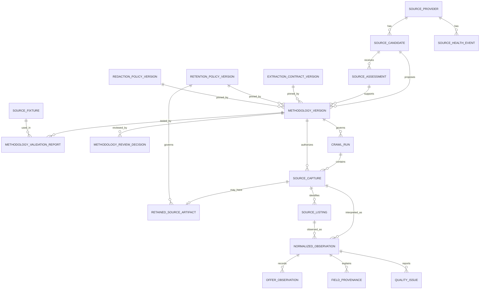
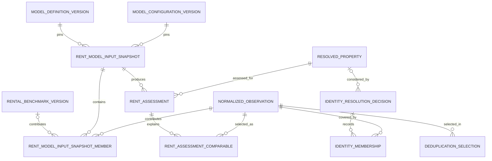
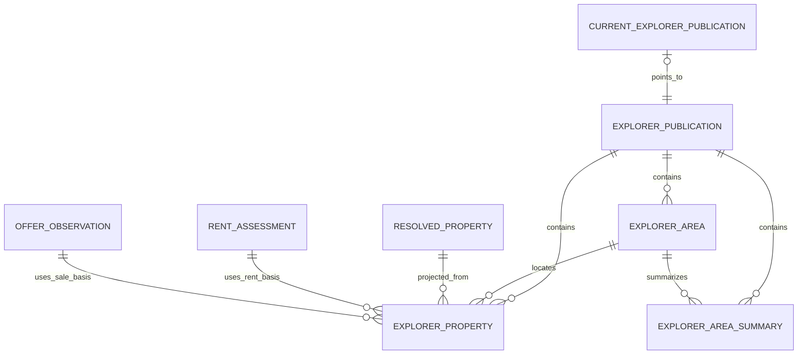

# Data Storage logical ERD

## Purpose

This is the logical entity-relationship design behind the [Data Storage System
Specification](../../specs/data-storage-spec.md). It identifies the durable
record groups and their relationships without selecting tables, keys, indexes,
partitions, an ORM, or migrations.

`||` means exactly one, `o|` zero or one, and `o{` zero or many. Records marked
**immutable** are append-only: a correction creates a new record. “Current” is
derived, except for the explicit current-publication pointer.

## 1. Governance, capture, and interpretation

```mermaid
erDiagram
  SOURCE_PROVIDER ||--o{ SOURCE_CANDIDATE : has
  SOURCE_CANDIDATE ||--o{ SOURCE_ASSESSMENT : receives
  SOURCE_CANDIDATE ||--o{ METHODOLOGY_VERSION : proposes
  SOURCE_ASSESSMENT ||--o{ METHODOLOGY_VERSION : supports
  EXTRACTION_CONTRACT_VERSION ||--o{ METHODOLOGY_VERSION : pinned_by
  RETENTION_POLICY_VERSION ||--o{ METHODOLOGY_VERSION : pinned_by
  REDACTION_POLICY_VERSION ||--o{ METHODOLOGY_VERSION : pinned_by
  METHODOLOGY_VERSION ||--o{ METHODOLOGY_VALIDATION_REPORT : tested_by
  METHODOLOGY_VERSION ||--o{ METHODOLOGY_REVIEW_DECISION : reviewed_by
  SOURCE_FIXTURE ||--o{ METHODOLOGY_VALIDATION_REPORT : used_in
  METHODOLOGY_VERSION ||--o{ CRAWL_RUN : governs
  CRAWL_RUN ||--o{ SOURCE_CAPTURE : contains
  METHODOLOGY_VERSION ||--o{ SOURCE_CAPTURE : authorizes
  SOURCE_CAPTURE ||--o| RETAINED_SOURCE_ARTIFACT : may_have
  RETENTION_POLICY_VERSION ||--o{ RETAINED_SOURCE_ARTIFACT : governs
  SOURCE_CAPTURE ||--o{ SOURCE_LISTING : identifies
  SOURCE_CAPTURE ||--o{ NORMALIZED_OBSERVATION : interpreted_as
  SOURCE_LISTING ||--o{ NORMALIZED_OBSERVATION : observed_as
  NORMALIZED_OBSERVATION ||--o{ OFFER_OBSERVATION : records
  NORMALIZED_OBSERVATION ||--o{ FIELD_PROVENANCE : explains
  NORMALIZED_OBSERVATION ||--o{ QUALITY_ISSUE : reports
  SOURCE_PROVIDER ||--o{ SOURCE_HEALTH_EVENT : has
```

| Record group                                                      | Meaning and reason to persist                                                                                                                                                  |
| ----------------------------------------------------------------- | ------------------------------------------------------------------------------------------------------------------------------------------------------------------------------ |
| Source provider, candidate, assessment, and health event          | **Immutable** source-review history. It establishes whether collection is permitted and makes a later pause or correction explainable.                                         |
| Methodology, extraction, redaction, and retention policy versions | **Immutable** versioned rules pinned to collection. A capture can be replayed or reviewed under the rules that actually governed it.                                           |
| Validation report and review decision                             | **Immutable** technical and authorization history; testing a method does not itself authorize it.                                                                              |
| Crawl run and source capture                                      | One approved execution and one source-qualified acquisition event. Equal bytes do not collapse separate collection events.                                                     |
| Retained source artifact                                          | Optional **immutable** metadata for policy-permitted bytes. PostgreSQL holds its digest, purpose, policy, and lifecycle; private object storage holds only the approved bytes. |
| Source listing and normalized observation                         | A source-qualified listing identity and an **immutable** versioned interpretation of a capture. Neither replaces the other.                                                    |
| Offer, field provenance, and quality issue                        | **Immutable** claims and explanations attached to an observation. They retain auditability even when an outcome is quarantined.                                                |

A normalized observation is identified by its capture plus methodology-manifest
hash, adapter-artifact hash, parser version, normalizer version, and
extraction-contract hash. Its output hash verifies the interpretation but is
not part of that identity.

An offer has mutually exclusive sale and rental variants. A rental variant holds
the observed base asking rent, frequency, fees, and terms. A sale offer has no
path to a Rent Model input snapshot or assessment.

## 2. Identity and Rent Model history

```mermaid
erDiagram
  RESOLVED_PROPERTY o|--o{ IDENTITY_RESOLUTION_DECISION : considered_by
  IDENTITY_RESOLUTION_DECISION ||--o{ IDENTITY_MEMBERSHIP : records
  NORMALIZED_OBSERVATION ||--o{ IDENTITY_MEMBERSHIP : covered_by
  NORMALIZED_OBSERVATION ||--o{ DEDUPLICATION_SELECTION : selected_in

  MODEL_DEFINITION_VERSION ||--o{ RENT_MODEL_INPUT_SNAPSHOT : pins
  MODEL_CONFIGURATION_VERSION ||--o{ RENT_MODEL_INPUT_SNAPSHOT : pins
  RENTAL_BENCHMARK_VERSION o|--o{ RENT_MODEL_INPUT_SNAPSHOT_MEMBER : contributes
  RENT_MODEL_INPUT_SNAPSHOT ||--o{ RENT_MODEL_INPUT_SNAPSHOT_MEMBER : contains
  NORMALIZED_OBSERVATION ||--o{ RENT_MODEL_INPUT_SNAPSHOT_MEMBER : contributes
  RENT_MODEL_INPUT_SNAPSHOT ||--o{ RENT_ASSESSMENT : produces
  RESOLVED_PROPERTY ||--o{ RENT_ASSESSMENT : assessed_for
  RENT_ASSESSMENT ||--o{ RENT_ASSESSMENT_COMPARABLE : explains
  NORMALIZED_OBSERVATION ||--o{ RENT_ASSESSMENT_COMPARABLE : selected_as
```

| Record group                                                             | Meaning and reason to persist                                                                                            |
| ------------------------------------------------------------------------ | ------------------------------------------------------------------------------------------------------------------------ |
| Resolved property, identity decision/membership, deduplication selection | Conservative, **immutable** cross-source analysis decisions. They never delete or rewrite source records.                |
| Benchmark, model definition, and configuration versions                  | **Immutable** inputs that prevent fallback or calculation behavior from drifting.                                        |
| Rent Model input snapshot and member                                     | A content-addressed, ordered, **immutable** evidence set with an as-of date and its applicable exclusions and decisions. |
| Rent assessment and comparable                                           | **Immutable** result and ordered selected-comparable provenance for historical explanation.                              |

Snapshot membership contains only eligible rental observations, permitted
benchmarks, and the decision records needed to interpret them. It never contains
a sale offer, sale price, or a value derived from sale price. An identical rerun
may reuse a snapshot and write another assessment occurrence; changed evidence
or rules require a new snapshot.

## 3. Explorer publication

```mermaid
erDiagram
  EXPLORER_PUBLICATION ||--o{ EXPLORER_AREA : contains
  EXPLORER_PUBLICATION ||--o{ EXPLORER_PROPERTY : contains
  EXPLORER_PUBLICATION ||--o{ EXPLORER_AREA_SUMMARY : contains
  EXPLORER_AREA ||--o{ EXPLORER_PROPERTY : locates
  EXPLORER_AREA ||--o{ EXPLORER_AREA_SUMMARY : summarizes
  CURRENT_EXPLORER_PUBLICATION o|--|| EXPLORER_PUBLICATION : points_to
  RESOLVED_PROPERTY ||--o{ EXPLORER_PROPERTY : projected_from
  RENT_ASSESSMENT ||--o{ EXPLORER_PROPERTY : uses_rent_basis
  OFFER_OBSERVATION ||--o{ EXPLORER_PROPERTY : uses_sale_basis
```

An **immutable** explorer publication contains its areas, property rows, and
area summaries under one publication identity. The one mutable
current-publication pointer moves only after the complete release is validated.
The backend reads this projection only; it does not join crawler, identity, or
model working records during a request.

## Physical-design baseline and open decisions

This ERD is derived from the current storage use cases and the
[conceptual model](data-storage-conceptual-model.md). Historical ERD material
was reference material during reconciliation, not an authority that can
override those sources.

The future physical design must preserve these logical invariants:

- a capture belongs to one crawl run and methodology; an artifact belongs to at
  most one capture;
- an observation belongs to one capture and source listing; a capture can have
  many historical interpretations;
- every offer, provenance item, and quality issue explains one observation;
- identity membership is a decision-scoped link to retained observations;
- a snapshot has deterministic ordered members and pins its model definition
  and configuration; and
- every explorer area, property, and summary belongs to one publication.

This document intentionally does not decide the physical representation of
geography versions, policy excerpts, association records, constraints, or
controlled views. Those require the physical-design approval gate in the
[durable-provider delivery plan](../../plan/data-storage-durable-provider.md).

## Traceability

| Storage use case               | ERD record groups                                      |
| ------------------------------ | ------------------------------------------------------ |
| Review and authorize a source  | Provider through methodology decision and health event |
| Ingest and audit a capture     | Crawl run through quality issue and optional artifact  |
| Construct rental-only evidence | Identity decisions through snapshot members            |
| Explain a rent assessment      | Snapshot, assessment, and comparable                   |
| Serve the explorer             | Publication through current-publication pointer        |
