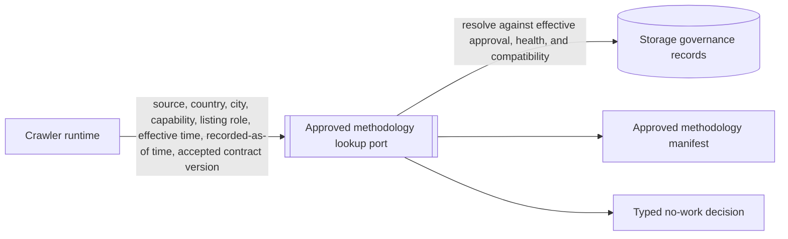
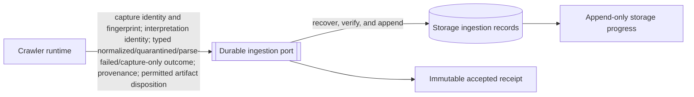
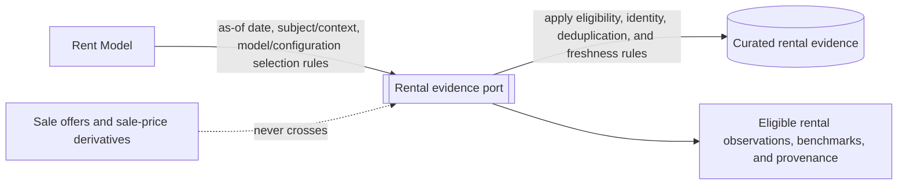
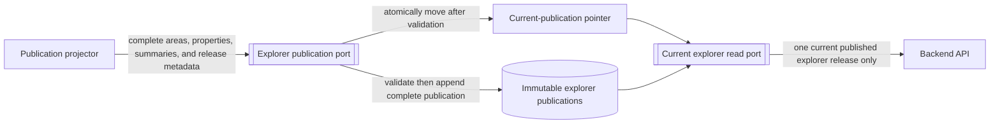

# Shared data-storage port contracts

## Purpose

This document defines the four shared interfaces that remain useful after the
[logical ERD](data-storage-erd.md). They explain who may ask Storage to do
what, the concepts that cross each boundary, and the information that must not
cross it. They are not runtime classes, database clients, API endpoints, or
persistence adapters.

The diagrams are retained because the ERD describes persistent relationships,
while these ports protect the boundary between independent parts of the
ecosystem:

1. Crawler runtime and approved methodology;
2. Crawler runtime and durable ingestion;
3. Rent Model and rental evidence; and
4. publication projector/backend and the explorer release.

The durable names below are logical contract names. The implementation may use
different language-level names, provided that it preserves the same authority,
information, and immutability rules.

## 1. Approved methodology lookup

| Contract aspect | Requirement                                                                                                                                             |
| --------------- | ------------------------------------------------------------------------------------------------------------------------------------------------------- |
| Caller          | Crawler runtime                                                                                                                                         |
| Request         | Source, Colombian country/city scope, capability, listing role, effective time, recorded-as-of time, and accepted contract version                      |
| Success         | Exactly one approved, effective, compatible methodology manifest with its pinned parser, normalizer, extraction, access, retention, and redaction rules |
| Non-success     | A typed reason to do no work: no match, ambiguity, expiry, revocation, pause, unhealthy source, or incompatible contract                                |
| Boundary        | The caller cannot supply a methodology, candidate, assessment, approval, object key, database credential, or artifact substitution                      |
| ERD trace       | Source candidate, assessment, methodology version, review decision, health event, and policy versions                                                   |
| Use-case trace  | Resolve approved methodology before collection                                                                                                          |

The lookup gives the crawler an approved policy envelope, not the governance
records behind it. This keeps source-review authority in Storage and lets the
crawler fail closed when permission is absent or unclear.

## 2. Durable ingestion submission and receipt

| Contract aspect | Requirement                                                                                                                                                                                 |
| --------------- | ------------------------------------------------------------------------------------------------------------------------------------------------------------------------------------------- |
| Caller          | Crawler runtime                                                                                                                                                                             |
| Request         | Source-scoped capture identity/fingerprint, all interpretation-identity components, outcome hash, typed outcome and field provenance, and permitted artifact disposition                    |
| Success         | An immutable acceptance receipt only after Storage can recover the submission                                                                                                               |
| Later state     | Append-only Storage progress such as committed, quarantined, or failed; it does not revise the runtime outcome                                                                              |
| Idempotency     | Same capture and interpretation with the same outcome returns the existing accepted identity; a changed capture fingerprint or changed outcome under the same interpretation fails closed   |
| Boundary        | The caller sends permitted bytes or an opaque Storage-issued staged reference. It never receives object keys, database credentials, storage layout, or authority to update historical facts |
| ERD trace       | Crawl run, source capture, retained source artifact, source listing, normalized observation, offer, provenance, and quality issue                                                           |
| Use-case trace  | Ingest capture and interpretation; retain permitted replay/audit evidence                                                                                                                   |

An artifact disposition can say that no body is retained, include bounded
permitted bytes, or use a Storage-issued staged reference. A redacted fixture is
the default for fixture mode and the first canary. An original HTML or JSON
source body is allowed only when an approved retention policy explicitly permits
the representation and purpose (parser replay or evidence audit). Images remain
out of scope by default.

## 3. Rental-evidence read

| Contract aspect | Requirement                                                                                                                                                         |
| --------------- | ------------------------------------------------------------------------------------------------------------------------------------------------------------------- |
| Caller          | Rent Model                                                                                                                                                          |
| Request         | As-of date and the subject/context plus the versioned selection rules needed to construct a snapshot                                                                |
| Result          | Eligible observed rental evidence, permitted benchmarks, relevant identity/deduplication decisions, and field-level provenance needed for reproducibility           |
| Eligibility     | Only active, long-term, residential, positive base monthly asking rent in COP with the required built-area and provenance evidence                                  |
| Exclusions      | Administration, utilities, variable fees, ambiguous values, stale/ineligible evidence, duplicate selections, sale offers, sale price, and any sale-price derivative |
| Boundary        | The port may return a reason/exclusion summary. It must never add a sale-price field or a value derived from one to its result                                      |
| ERD trace       | Identity decision/membership, deduplication selection, benchmark version, input snapshot/member, assessment, and comparable                                         |
| Use-case trace  | Build frozen model input; create an explainable rent assessment                                                                                                     |

Storage, not the Rent Model, decides whether a stored observation qualifies as
rental evidence according to the supplied versioned rules. The Rent Model then
records the selected canonical membership in an immutable input snapshot before
writing an assessment.

## 4. Explorer publication and current read

| Contract aspect | Publication write                                                                                     | Current explorer read                                                                                                             |
| --------------- | ----------------------------------------------------------------------------------------------------- | --------------------------------------------------------------------------------------------------------------------------------- |
| Caller          | Publication projector                                                                                 | Backend API                                                                                                                       |
| Request         | One complete publication: areas, properties, summaries, release metadata, and their source basis      | Current publication query plus explorer filters                                                                                   |
| Success         | Immutable complete publication, then an atomic change to the current pointer                          | Only records belonging to the one current publication                                                                             |
| Boundary        | The projector alone writes this projection; it does not mutate prior publications                     | The backend cannot read captures, artifacts, identity decisions, model snapshots, or unpublished/older releases through this port |
| Consistency     | Areas, explorer properties, and area summaries share exactly one publication identity                 | A request cannot mix rows from different publications                                                                             |
| ERD trace       | Explorer publication, explorer area, explorer property, area summary, and current-publication pointer |
| Use-case trace  | Publish a coherent explorer release; serve the frontend                                               |

The explorer property contains the publication-ready result, including its
eligible sale basis and observed or assessed rent basis. The backend does not
recalculate rent or yield from internal evidence at request time.

## Cross-port rules

- Ports transfer logical records, never direct access to PostgreSQL, PostGIS,
  object storage, or internal object locations.
- Every versioned input is explicit: methodology, policy, parser/normalizer,
  model/configuration, and publication versions cannot be silently replaced.
- All ports preserve the sale-price firewall. The publication path may use an
  eligible sale basis to make the explorer useful; the rental-evidence path
  cannot.
- A port result is sufficient for its caller’s job, but no caller obtains
  broader review, retention, identity-resolution, or storage-administration
  authority by using it.

## Deliberately not modeled here

This document adds no general application class diagram. It does not specify
HTTP routes, language interfaces, DTO fields, database tables, object keys,
storage transactions, or implementation classes. Those belong to later shared
contract and persistence-adapter work once the port behavior is approved.
