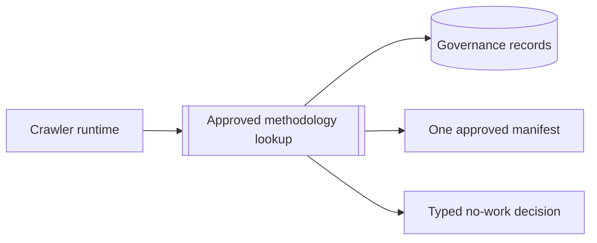
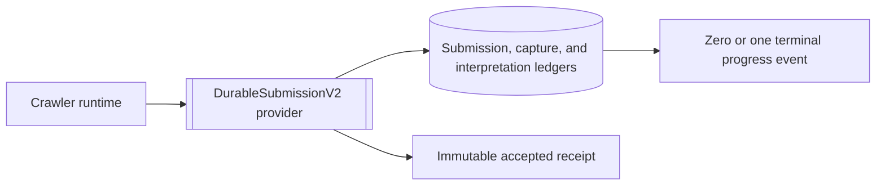
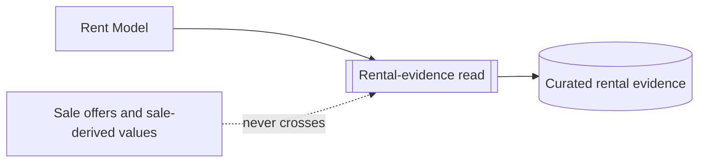
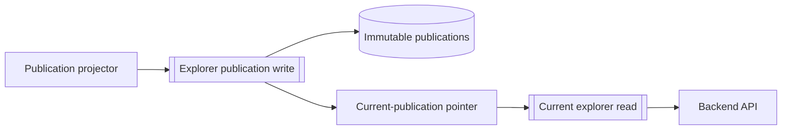

# Data Storage port contracts

## Purpose

The [logical ERD](data-storage-erd.md) shows what must persist. This document
shows the four logical boundaries that keep callers from receiving database
access, object locations, or authority outside their job. They are not API
routes, language interfaces, table clients, or persistence adapters.

## 1. Approved methodology lookup

```mermaid
flowchart LR
  crawler[Crawler runtime] --> port[[Approved methodology lookup]]
  port --> governance[(Governance records)]
  port --> allowed[One approved manifest]
  port --> denied[Typed no-work decision]
```

The crawler requests source, Colombian country/city scope, capability, listing
role, effective time, recorded-as-of time, and accepted contract version. It
receives exactly one approved compatible methodology, or a typed no-work reason
for no match, ambiguity, expiry, revocation, pause, incompatibility, or an
active health block. It cannot submit a methodology, candidate, approval, or
artifact substitution.

## 2. Durable V2 ingestion

```mermaid
flowchart LR
  crawler[Crawler runtime] --> sink[[DurableSubmissionV2 provider]]
  sink --> ledger[(Submission, capture, and interpretation ledgers)]
  sink --> receipt[Immutable accepted receipt]
  ledger --> progress[Zero or one terminal progress event]
```

The MVP Crawler submits only a complete, listing-quality-passing `normalized`
outcome with at least one normalized observation, provenance, a V2 capture
identity/fingerprint, interpretation identity, and permitted artifact
disposition. Capture evidence records the observed original-response
digest/length; any redacted fixture artifact has its own digest/length.
Storage validates durable admission, including the normalized-only rule and
V2 integrity/conflict semantics, before issuing an immutable receipt. It never
receives a database credential, object key, raw body location, or an operation
to issue a storage reference.

`quarantined`, `parse_failed`, and `capture_only` are local transient Crawler
results in this POC and receive no durable receipt or tombstone. The initial
producer dispositions are bounded `inline_redacted` and `no_retained_bytes`;
oversized fixtures are discarded without truncation or a reference. Fixture
byte retention and durable health-event intake are explicitly deferred.

The merged `DurableSubmissionV2` contract is the authoritative behavior:

| Situation                                                                      | Required behavior                                               |
| ------------------------------------------------------------------------------ | --------------------------------------------------------------- |
| Same `(source_key, submission_id)` and canonical submission                    | Return the original receipt unchanged (exact replay).           |
| Same key with a changed submission                                             | Return the contract's idempotency conflict.                     |
| Same source/capture event with changed fingerprint                             | Return `capture_event_conflict`.                                |
| New submission ID, same capture + five-field interpretation + verified outcome | Link the immutable interpretation and issue a distinct receipt. |
| Same interpretation with a different verified outcome                          | Return `interpretation_conflict`.                               |
| Storage cannot durably accept responsibility                                   | Return no successful receipt.                                   |

`progress(receipt_id, after_sequence)` exposes zero or one terminal
`committed`, `quarantined`, or `failed` event. The POC producer does not use a
receipt to persist a non-normalized result; `quarantined` remains available for
provider-owned post-acceptance handling and future approved producers.
Provider-issued staged and verified references support provider-owned workflows
and the test-only conformance fixture adapter; the crawler has no
reference-issuance or object-upload port.

## 3. Rental-evidence read

```mermaid
flowchart LR
  model[Rent Model] --> port[[Rental-evidence read]]
  port --> evidence[(Curated rental evidence)]
  blocked[Sale offers and sale-derived values] -. never crosses .-> port
```

The Rent Model requests an as-of date, subject/context, and versioned selection
rules. Storage returns eligible observed rental evidence, permitted benchmarks,
applicable identity/deduplication decisions, and provenance needed to freeze a
snapshot. This is a later, stricter gate than ingestion-quality admission: a
durably accepted normalized listing can still have no eligible rental offer.
The result has no sale-price field or derivative. Storage enforces rental-only
admission; model configuration owns the matching and selection rules.

## 4. Explorer publication and read

```mermaid
flowchart LR
  projector[Publication projector] --> writer[[Explorer publication write]]
  writer --> publication[(Immutable publications)]
  writer --> pointer[Current-publication pointer]
  pointer --> reader[[Current explorer read]]
  reader --> backend[Backend API]
```

The projector submits one complete release of areas, properties, summaries, and
release metadata. Storage validates it, appends an immutable publication, then
atomically moves the current pointer. The backend can read only rows from that
one current publication; it cannot read captures, retained artifacts, identity
decisions, model snapshots, or older/unpublished releases through this port.

## Cross-port rules

- Ports transfer logical records, never direct PostgreSQL, PostGIS, or object
  storage access.
- Pinned methodology, policy, parser/normalizer, model/configuration, and
  publication versions cannot be silently substituted.
- The sale-price firewall applies to every port: publication may use an
  eligible sale basis, but rental evidence never can.
- The physical endpoint and DTO shapes remain unresolved until their respective
  delivery plans are approved; they must preserve these boundaries.
