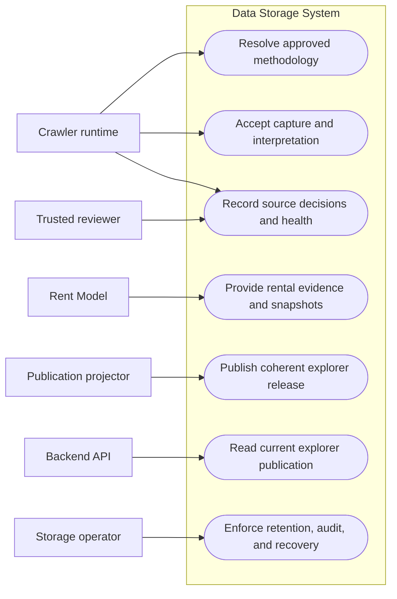

# Data Storage System Specification

## Purpose

The storage system must let us answer four questions reliably:

1. What did a source show, and how did we interpret it?
2. What exact evidence did the Rent Model use?
3. What complete data release should the backend show to users?
4. Who approved, changed, blocked, or removed something, and why?

The design should remain simple in version one. We will use one logical
PostgreSQL/PostGIS database. Private object storage is an optional companion
for a small set of permitted source documents; it is not a second application
database.

## Supporting architecture artifacts

Use this specification for the storage requirements and these documents for
their progressively more detailed views:

- [Conceptual storage model](../docs/architecture/data-storage-conceptual-model.md)
  explains the durable concepts and why they exist.
- [Logical storage ERD](../docs/architecture/data-storage-erd.md) defines the
  entities, relationships, cardinalities, and immutable boundaries.
- [Shared storage port contracts](../docs/architecture/data-storage-port-contracts.md)
  defines the four caller boundaries without exposing implementation details.
- [Storage-modeling review](../docs/architecture/data-storage-modeling-review.md)
  records cross-consumer traceability and the boundary checks performed.

The use-case diagram below remains the simplest entry point for readers who
need to understand Storage's responsibilities before reading the detailed
artifacts.

## Who the system serves

| Consumer                | What storage provides                                                                                                              | Why                                                                                               |
| ----------------------- | ---------------------------------------------------------------------------------------------------------------------------------- | ------------------------------------------------------------------------------------------------- |
| Crawlers                | Approved methodology lookup and a durable submission boundary for captures, fixtures, observations, provenance, and quality issues | Crawlers should collect data without knowing database tables, credentials, or object keys.        |
| Rent Model              | Frozen input snapshots and a rental-only evidence view                                                                             | A past rent assessment must be reproducible, and sale price must never influence a rent estimate. |
| Backend explorer        | A small, read-only publication layer                                                                                               | The map and chart need one complete, consistent release instead of crawler and model internals.   |
| Reviewers and operators | Source decisions, health blocks, retention actions, and audit history                                                              | Access and data handling decisions must be explainable and enforceable.                           |

## Storage use cases

This is a responsibility map, not an ERD or a data-flow diagram. It shows what
each actor needs Storage to do; the detailed records and relationships appear
later in this specification and its supporting architecture documents.



## Simple architecture

The database uses three schemas to make ownership clear:

| Schema      | Purpose                                                                                 | Typical writers                                      |
| ----------- | --------------------------------------------------------------------------------------- | ---------------------------------------------------- |
| `ingestion` | Source governance, captures, extracted observations, provenance, and identity decisions | Controlled crawler ingestion and reviewer operations |
| `model`     | Benchmarks, frozen model inputs, rent assessments, and selected comparables             | Rent Model                                           |
| `app`       | Complete releases prepared for the backend explorer                                     | Publication projector                                |

The schemas are organizational boundaries. Database roles and controlled
operations provide the security boundary.

```text
source review and crawler
          |
          v
  ingestion schema -----> private object storage, only when permitted
       |       |
       |       v
       |   model schema
       |       |
       +---+---+
           v
       app schema -----> backend API -----> frontend
```

Use PostgreSQL with PostGIS and preserve compatibility with Aiven PostgreSQL.
Private object storage should use an S3-compatible interface. The contracts
must not depend on a particular ORM or object-storage vendor.

## Core rules

- Evidence is append-only by default. A correction creates a new record and
  preserves the prior record.
- “Current” data is a derived view, not an overwrite of history.
- Collection events remain distinct even when their content is identical.
- Source listings, resolved properties, and published explorer rows are
  different concepts and must not share one overloaded identity.
- Sale and rental offers are separate records.
- Only eligible observed monthly asking rent may enter rental evidence; fees
  and explicitly bundled parking follow the Rent Model rules below.
- Sale price and values derived from it cannot cross the Rent Model boundary.
- Model inputs and published explorer releases are immutable versions.
- Unknown values remain unknown. Storage and normalization must not invent
  missing facts.
- Retention, privacy, or licensing removals use an authorized tombstone or
  redaction record. They are never silent deletions.

## What must be stored

The names below describe the durable record groups. Implementations may add
supporting indexes and operational tables, but should keep these names and
meanings recognizable.

### Source governance

| Record                                    | What it means                                                                               | Why it exists                                                                                             |
| ----------------------------------------- | ------------------------------------------------------------------------------------------- | --------------------------------------------------------------------------------------------------------- |
| `ingestion.source_provider`               | A source we have considered using                                                           | Gives every assessment, methodology, and capture a stable source identity.                                |
| `ingestion.source_candidate`              | One immutable version of a proposed source and scope                                        | Keeps corrected proposals from silently inheriting an older assessment.                                   |
| `ingestion.source_assessment`             | A dated assessment of access, terms, robots, API, privacy, and retention                    | Records what was reviewed, the evidence, unresolved questions, and the next review date.                  |
| `ingestion.sanitized_probe_result`        | Scope, budget usage, response digest and size, outcome, and issues from one permitted probe | Proves what was tested without retaining bodies, credentials, cookies, headers, or arbitrary source text. |
| `ingestion.extraction_contract_version`   | The immutable source-to-canonical field mapping used by a parser                            | Makes a referenced mapping available for replay and audit instead of storing only its hash.               |
| `ingestion.source_methodology_version`    | One immutable methodology manifest proposed for review                                      | Preserves the exact scope, limits, adapter, parser, extraction contract, and retention rules.             |
| `ingestion.methodology_validation_report` | The immutable result of testing a methodology against named fixtures                        | Shows what was verified before review.                                                                    |
| `ingestion.methodology_review_decision`   | Approval, rejection, pause, revocation, or retirement by a trusted reviewer                 | Separates technical research from authorization. A later approval records reactivation.                   |
| `ingestion.source_health_event`           | A parser drift, access failure, rate limit, challenge, or emergency block                   | Lets the resolver fail closed when a source is unsafe or unhealthy.                                       |
| `ingestion.source_fixture`                | Metadata for a synthetic or permitted redacted replay fixture                               | Makes parser testing reproducible without live source access.                                             |
| `ingestion.retention_policy_version`      | Allowed representations and uses, expiry rule, and deletion behavior                        | Makes retention enforceable instead of implied.                                                           |
| `ingestion.redaction_policy_version`      | The immutable rules used to remove sensitive or unnecessary content                         | Makes sanitized artifacts reproducible and reviewable.                                                    |

Normally, a source-policy review stores its URL, retrieval time, effective date
when known, content digest, conclusion, and the smallest useful supporting
excerpt. A full policy page or PDF is retained only when compliance requires
durable proof and the applicable terms allow it.

### Collection and interpretation

| Record                                     | What it means                                                                                   | Why it exists                                                                                                            |
| ------------------------------------------ | ----------------------------------------------------------------------------------------------- | ------------------------------------------------------------------------------------------------------------------------ |
| `ingestion.crawl_run`                      | One execution under one approved methodology version                                            | Groups operational events without becoming listing identity.                                                             |
| `ingestion.source_capture`                 | One acquisition event, including request/response metadata, collection time, and content digest | Two fetches are two historical events even when their bytes match.                                                       |
| `ingestion.retained_source_artifact`       | Metadata for permitted source bytes kept in private object storage                              | Tracks digest, media type, size, purpose, retention policy, and storage state without exposing object keys to consumers. |
| `ingestion.source_listing`                 | A source-qualified listing identity                                                             | Prevents an identifier from one source being mistaken for the same identifier at another source.                         |
| `ingestion.normalized_listing_observation` | One versioned canonical interpretation of an observation                                        | Gives downstream systems consistent types without rewriting the source claim.                                            |
| `ingestion.listing_offer_observation`      | One sale or rental offer observed at a point in time                                            | Keeps sale price, base rent, fees, currency, and frequency explicit and separate.                                        |
| `ingestion.observation_field_provenance`   | The source path, original value, transformation, and issue for a normalized field               | Lets a reviewer trace a price, rent, area, or date back to evidence.                                                     |
| `ingestion.observation_quality_issue`      | A typed warning or blocking problem                                                             | Supports quarantine without losing the submitted evidence.                                                               |

An interpretation is identified by its capture plus the methodology manifest
hash, adapter artifact hash, parser version, normalizer version, and
extraction-contract hash. Its output hash verifies the result; it is not part
of the identity. This allows the same capture to be reinterpreted after a
methodology, parser, or normalization change.

### Property identity and deduplication

| Record                                   | What it means                                                  | Why it exists                                                             |
| ---------------------------------------- | -------------------------------------------------------------- | ------------------------------------------------------------------------- |
| `ingestion.resolved_property`            | A conservative candidate for one real-world property           | Provides a stable analytical identity without deleting source identities. |
| `ingestion.identity_resolution_decision` | A versioned match, non-match, or manual decision with evidence | Makes cross-source linking reviewable and reversible.                     |
| `ingestion.identity_membership`          | The source observations covered by an identity decision        | Shows why a resolved property has its members.                            |
| `ingestion.deduplication_selection`      | A versioned choice of which observations count in an analysis  | Prevents duplicate evidence while retaining every original record.        |

Version one may automatically match only strong evidence, such as a documented
exact address and unit or a stable cross-source reference. Similar titles or
prices alone are not enough.

### Rent Model history

| Record                                   | What it means                                                                                                     | Why it exists                                                             |
| ---------------------------------------- | ----------------------------------------------------------------------------------------------------------------- | ------------------------------------------------------------------------- |
| `model.rental_benchmark_version`         | An immutable benchmark with vintage, scope, sample information, uncertainty, and provenance                       | A fallback estimate must not drift after publication.                     |
| `model.model_definition_version`         | A model ID and version with its code or artifact hash                                                             | Pins the exact calculation implementation.                                |
| `model.model_configuration_version`      | Matching, freshness, range, percentile, and rounding rules with a content hash                                    | Pins behavior that can change without changing model code.                |
| `model.rent_model_input_snapshot`        | A content-addressed, frozen evidence set                                                                          | Re-running against the same snapshot must use the same inputs.            |
| `model.rent_model_input_snapshot_member` | An ordered subject, rental observation, or benchmark member                                                       | Records exact evidence membership and content hashes.                     |
| `model.rent_assessment`                  | One immutable observed, observed-with-context, comparable-modeled, benchmark-modeled, or insufficient-data result | Consumers can distinguish a fact, an estimate, a fallback, and no answer. |
| `model.rent_assessment_comparable`       | An ordered selected comparable and its relevant calculations                                                      | Explains how a comparable-based result was produced.                      |

A snapshot records its as-of date, canonical ordered evidence and content
hashes, referenced exclusions and identity/deduplication decisions, geography
version, benchmark versions, and model/configuration/code versions. A recrawl,
correction, normalizer change, identity decision, benchmark change, or version
change creates a new snapshot. An identical rerun reuses the snapshot and
creates a separate immutable assessment occurrence.

An assessment records its snapshot, as-of date, explicitly supplied
`generated_at`, kind, model/configuration versions, point and range when valid,
evidence level, matching or fallback tier, ordered reason codes, and exclusion
summary. An insufficient-data assessment stores no amount or range.
Comparable rows store canonical order, observation ID and content hash, rent
per square metre, subject-adjusted rent, and selection tier.

### Backend publication layer

The backend reads only these app-facing records:

| Record                             | What it serves                                                                                                                |
| ---------------------------------- | ----------------------------------------------------------------------------------------------------------------------------- |
| `app.explorer_publications`        | Immutable complete publication versions, including their data label, formula version, and default area.                       |
| `app.current_explorer_publication` | The one pointer changed when a validated publication becomes visible.                                                         |
| `app.explorer_areas`               | Stable area IDs, names, hierarchy, display settings, and simplified map geometry or a geometry reference for one publication. |
| `app.explorer_properties`          | Map markers and ranked property candidates for one publication.                                                               |
| `app.explorer_area_summaries`      | Counts and aggregate metrics for one area in one publication.                                                                 |

One `app.explorer_properties` row means:

> One resolved residential property candidate in one published version,
> combining one eligible sale-price basis with one published observed or
> estimated rent basis.

It is not a crawler listing, capture, offer, or Rent Model comparable. Its
public property ID should remain stable across later publications when the
resolved property remains the same.

The table contains only publishable rows that satisfy the backend API's
rankable-property rule. The same population defines `property_count` and every
area summary. Selecting a city includes members of its supported child areas;
selecting a neighborhood returns that neighborhood's members.

Each row includes the location and area, display address, coordinates,
residential type, available property traits, sale-price basis, rent basis,
source labels, publishable listing URL, assessment kind, sale-offer status, and
publication eligibility. Freshness is represented by dates until a versioned
policy defines a derived `stale` status.

Freshness must also remain explicit:

- when the sale offer was observed;
- the rent assessment's as-of date;
- when the projection was built; and
- when the publication became visible.

A single `observed_at` field cannot represent all four meanings. The backend
API should expose the fields its users need without merging them into a false
timestamp.

Areas, properties, and summaries all belong to the same publication version.
The projector is the only writer to `app.explorer_*`. It uses the shared,
versioned domain formulas to calculate property metrics and summaries, then
validates the complete batch. The stored metrics are the publication values;
the backend does not independently recalculate a different answer. It makes a
release visible by atomically changing `app.current_explorer_publication`.
Backend access goes through current-publication views or a controlled query so
ordinary requests cannot mix in older rows. If a refresh fails, readers keep
seeing the previous complete version.

## Crawler-facing contracts

Crawlers use ports, not tables.

### Approved methodology lookup

The lookup takes source, country, city, capability, listing role, effective
time, recorded-as-of time, and accepted contract version. It returns exactly
one approved compatible methodology or a typed reason that no work is allowed.

Effective time asks which decision applied then. Recorded-as-of time asks what
Storage knew then.

The lookup fails closed for missing or overlapping approvals, expiry, pause,
revocation, incompatible adapters, or an active source-health block.

### Durable ingestion submission

The versioned submission contains:

- source and approved methodology identity;
- idempotency key and capture event ID;
- sanitized acquisition metadata, content digest, length, and representation;
- permitted redacted fixture bytes when applicable;
- the complete normalized or quarantined outcome;
- field-level provenance and typed quality issues; and
- the interpretation identity and canonical outcome hash.

For version one, bounded permitted bytes are supplied through the storage port.
The storage provider owns staging, digest verification, and object placement.
Crawlers never construct object keys. A later large-document workflow may add
a verified staged-upload handle without changing the storage semantics.

### Receipt behavior

| Situation                                                           | Required result                                                                                                |
| ------------------------------------------------------------------- | -------------------------------------------------------------------------------------------------------------- |
| Same source and idempotency key, same canonical submission          | Return the byte-for-byte original immutable receipt; report duplication separately or append a delivery event. |
| Same source and idempotency key, changed submission                 | Return `idempotency_conflict`.                                                                                 |
| Same source and capture event, changed acquisition metadata or body | Return `capture_event_conflict`.                                                                               |
| New capture event and key, identical body                           | Append a new capture; it may reference the same retained object.                                               |
| Same capture, new interpretation identity                           | Append a new interpretation.                                                                                   |
| Same capture and interpretation identity, same outcome hash         | Return the existing interpretation with duplicate-delivery metadata.                                           |
| Same capture and interpretation identity, different outcome hash    | Return `interpretation_conflict`.                                                                              |
| Storage cannot durably accept responsibility                        | Return no successful receipt.                                                                                  |

An immutable `accepted` receipt means storage can recover and finish the work.
It does not mean finalization succeeded or the data qualifies for the model.
Later append-only progress events report:

- `committed`: capture and interpretation are durably linked;
- `quarantined`: evidence is durable but blocked from normal publication by
  typed issues; or
- `failed`: finalization ended with a sanitized terminal cause, and a retry
  needs a new submission key.

PostgreSQL and object storage cannot participate in one transaction. The
provider therefore uses staged objects, a database transaction and outbox,
digest verification, a finalizer, and reconciliation.

The canonical submission hash excludes the idempotency key and
provider-generated fields. It includes canonical capture metadata, exact body
digest, methodology identity, interpretation identity, outcome, provenance,
and quality issues.

## Object storage policy

PostgreSQL is the system of record for metadata, policy, relationships, and
state. Private content-addressed object storage holds bytes only when their
size or immutable replay purpose makes a database row inappropriate.

Store an object only for one of these approved uses:

1. A redacted source-derived fixture used to replay and test a parser.
2. A permitted original HTML, JSON, XML, CSV, or source PDF needed to replay a
   parser without requesting a volatile source again.
3. A permitted original document needed to prove what the source showed for a
   model-eligible or published price, rent, fee, area, or date.
4. A policy snapshot that compliance explicitly requires and may retain.

Original source bytes require an approved retention policy, a valid replay or
audit purpose, representation/size/privacy/licensing checks, an expiry rule,
and private encrypted storage. If policy is missing, do not retain the bytes.

Do not store listing images by default. The crawler and Rent Model do not need
them. A future visual use case requires its own approval, licensing, privacy,
and retention decision.

The first real-world canary retains no original response body. It hashes the
response, redacts and scans it in memory, keeps only the approved sanitized
receipt and redacted fixture artifacts, and discards the original bytes. Until
the durable provider passes its conformance tests, those files are test
artifacts and do not prove durable ingestion.

## Rent Model evidence boundary

The model receives a dedicated rental-evidence view. An observation qualifies
only when it has:

- an observed, positive monthly long-term asking rent in COP that excludes
  administration, utilities, and variable fees; explicitly bundled parking may
  remain;
- positive built area;
- a supported property type and geography;
- a usable observation date;
- source-qualified identity and provenance; and
- quality information and versioned identity/deduplication decisions needed by
  the snapshot policy.

Fees must remain separate. If eligible rent cannot be separated from
administration, utilities, or variable fees, the observation is not eligible.
Ambiguous identities remain separate and carry an `identity_ambiguous` reason;
the versioned snapshot policy decides their use. A modeled rent can never
become rental evidence for another assessment.

For a given snapshot, evidence must have `observed_at` on or before its as-of
date and pass the Rent Model's inclusive 180-day freshness rule. Storage keeps
the timestamps; the versioned model configuration owns the selection rule.

The model-facing record contains no sale price, price per square metre, yield,
sale-to-rent ratio, ranking, or value derived from sale price. A sale listing
may provide subject characteristics such as location, property type, and built
area, but not its price. Changing sale-price data must be incapable of changing
a rent assessment.

## Money, time, and geography

- PostgreSQL `numeric` is authoritative for money, area, rent per square metre,
  and calculations. Shared ports use canonical decimal strings, not binary
  floating point.
- Timestamps use UTC `timestamptz` where an instant is known.
- `collected_at`, model-relevant `observed_at`, source-declared date text,
  snapshot `as_of_date`, assessment `generated_at`, projection time, and
  publication time remain separate.
- Source-declared date text and its known precision or timezone uncertainty are
  preserved.
- `observed_at` uses a reliable source event time when the approved methodology
  defines one; otherwise it uses collection time. The original source date and
  the choice remain traceable.
- Assessment `generated_at` is supplied explicitly and stored; the model never
  reads the database or server clock to obtain it.
- Stable geography IDs and versioned PostGIS geometry support assignment and
  spatial indexes. The app layer exposes only the display geometry needed by
  the explorer.

## Access, retention, and recovery

Use separate least-privilege roles for migrations/admin, crawler ingestion,
review, model work, projection, and backend reads. In particular:

- crawlers use controlled operations and never receive broad table access;
- the model reads curated rental evidence, not raw objects or sale prices;
- the projector alone writes app publications;
- the backend reads only the current published `app` records; and
- the frontend reaches data only through the backend API.

Database and internal port values remain exact decimals. The HTTP adapter
converts approved explorer values to the numeric JSON fields defined by the
backend API.

Version one does not add a product authentication system for reviewers. It may
use a manually managed stable reviewer key and restricted database role so each
decision still has a durable author.

Production storage uses private networking where available, encryption in
transit and at rest, secret rotation, and access auditing. Object and database
reconciliation must detect missing, orphaned, or digest-mismatched objects.

Retention periods are source- and purpose-specific entries in an authoritative
policy registry. Expiry creates an auditable deletion or tombstone event and
invalidates affected derived data where required. We will not invent one
universal duration before those policies are approved.

## Version-one simplicity limits

Version one does not require:

- a second application database;
- a data warehouse or lakehouse;
- Kafka or another event-streaming platform;
- retained listing images;
- automatic fuzzy cross-source merging;
- user-specific or authentication data;
- table partitioning before measured volume requires it; or
- direct frontend, backend, crawler, or model access to object keys.

## Implementation acceptance criteria

Durable storage is ready only when provider-neutral tests prove:

- methodology lookup and fail-closed governance behavior;
- immutable history, exact retries, conflicts, reinterpretation, and receipt
  progress behavior;
- quarantine, object finalization, reconciliation, and retention behavior;
- rental-only evidence and sale-price exclusion;
- deterministic immutable snapshots and assessments;
- complete, atomic explorer publication and read isolation; and
- Aiven PostgreSQL compatibility.

No test needs to contact a live listing source. Implementation requires its own
approved delivery plan and tracked tasks before migrations or adapters are
written.
